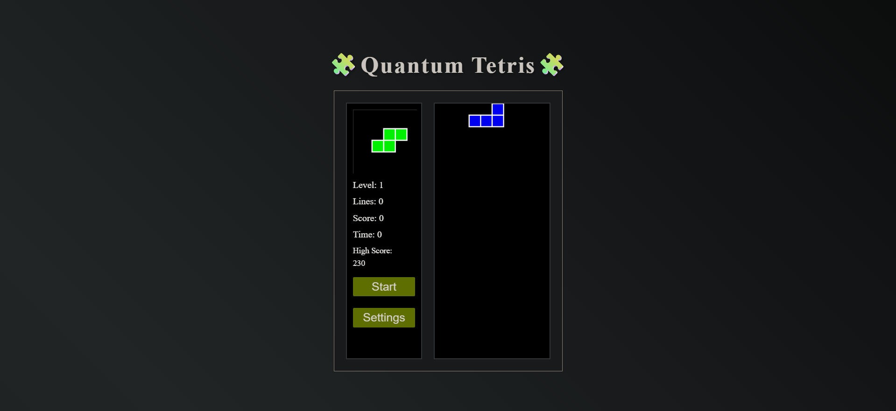
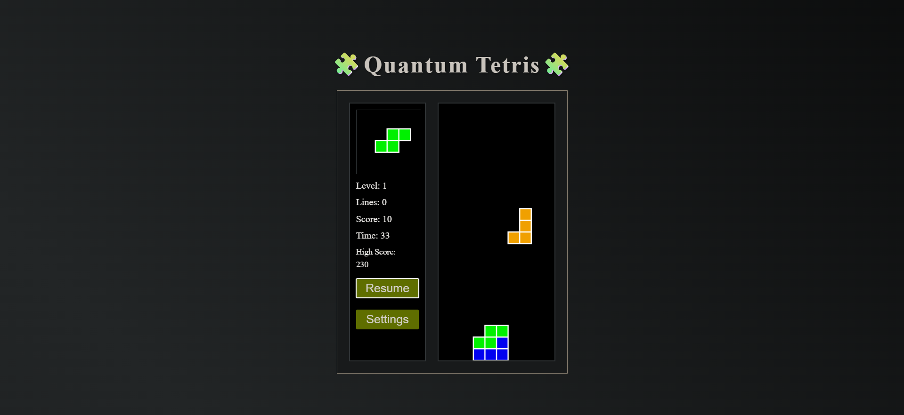

# 🧩 Quantum Tetris

[](https://developer.mozilla.org/docs/Web/HTML)
[](https://developer.mozilla.org/docs/Web/CSS)
[](https://developer.mozilla.org/docs/Web/JavaScript)
[](https://github.com/OmKadane/Quantum-Tetris/stargazers)
[](https://github.com/OmKadane/Quantum-Tetris/network/members)

---

A modern, visually appealing Tetris game built with JavaScript, HTML5, and CSS3.  
Enjoy classic gameplay with a quantum twist, smooth controls, and a beautiful UI!

---

## 🎮 Screenshots

**Screenshot 1**  


**Screenshot 2**  


---

## ✨ Features

- Responsive and animated UI
- Pause/Resume and Game Over overlays
- Next piece preview
- High score tracking (local storage)
- Customizable controls and speed
- Sound effects for moves, clears, and game over
- Play Again button and level/score display

---

## 🚀 Getting Started

1. **Clone the repo:**
   ```bash
   git clone https://github.com/OmKadane/Quantum-Tetris.git
   cd Quantum-Tetris
   ```

2. **Open `index.html` in your browser.**

No build steps required!

---

## 🕹️ How to Play

- **Move Left/Right:** Arrow keys (customizable)
- **Rotate:** Arrow Up (customizable)
- **Soft Drop:** Arrow Down (customizable)
- **Pause/Resume:** Escape (customizable)
- **Settings:** Change controls and speed

---

## 📈 High Scores

Your best score is saved in your browser. Challenge yourself to beat it!

---

## 🤝 Contributing

Pull requests are welcome! For major changes, please open an issue first to discuss what you would like to change.

---

## 📄 License
Distributed under the **MIT License**. See the [LICENSE](./LICENSE) file for details.

---

## 👤 Author

[Om Kadane](https://github.com/OmKadane)

---

> ⭐ Star this repo if you like it!